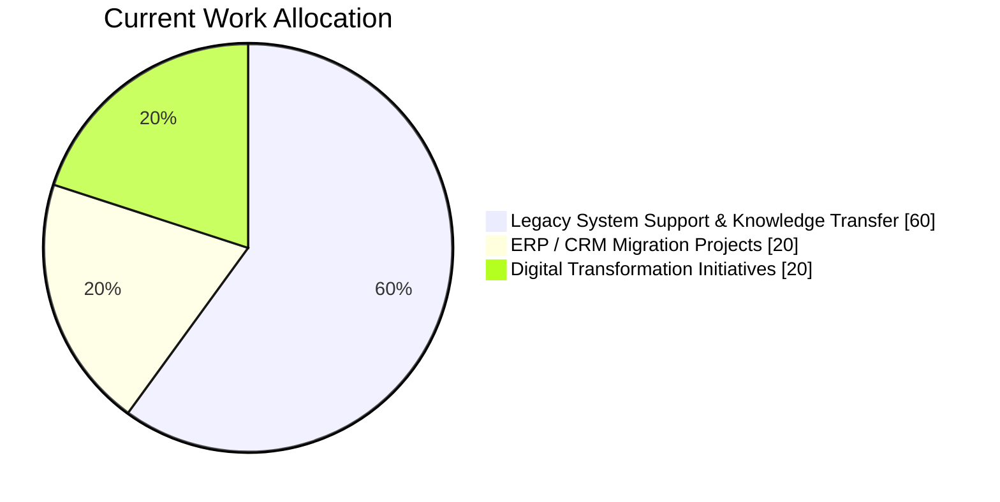

# KS LIM

Application System Engineer at ARVOS K.K.  
Since September 2026

## Current Project Focus

## Development Environment

| Category | Tool |
|-----------|------|
| Code Editor | Visual Studio Code |
| Version Control | Git |
| Git Client | SourceTree |
| Database Management | SQL Server Management Studio (SSMS) |
| Database Platform | Microsoft SQL Server |
| Programming Language | Python |
| JavaScript Runtime | Node.js LTS |
| Linux Environment | Ubuntu / WSL |
| Data Analysis & Prototyping | JupyterLab / Jupyter Notebook |
| API Development & Testing | Postman |
| Database Client | DBeaver Community |
| File Comparison | WinMerge |
| Diagramming & Documentation | Draw.io |

## Areas of Interest

- Business Application Development
- Database Management & SQL
- Python Django Development
- Business Process Automation
- ERP & System Integration
- Digital Transformation
