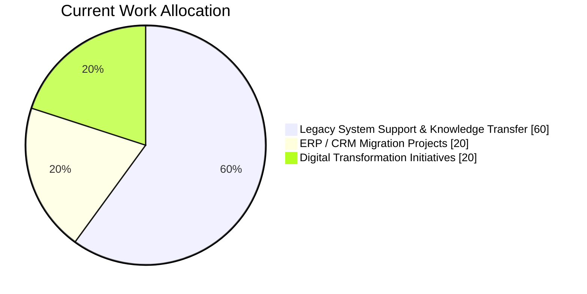
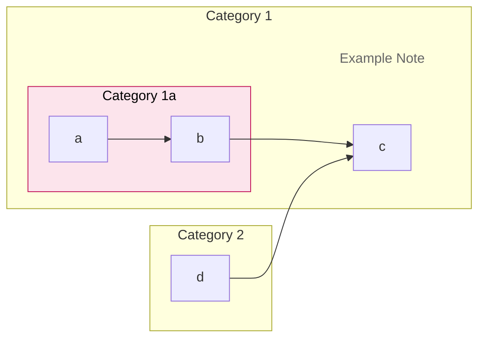
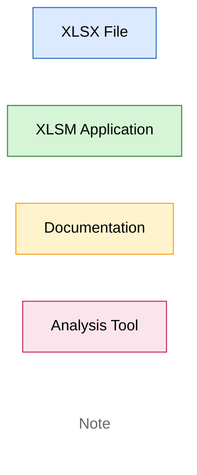
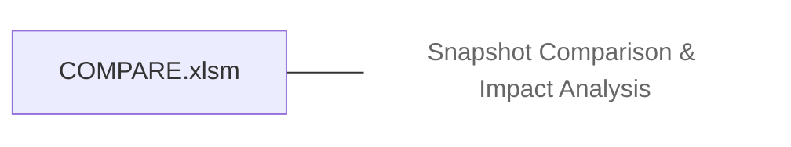
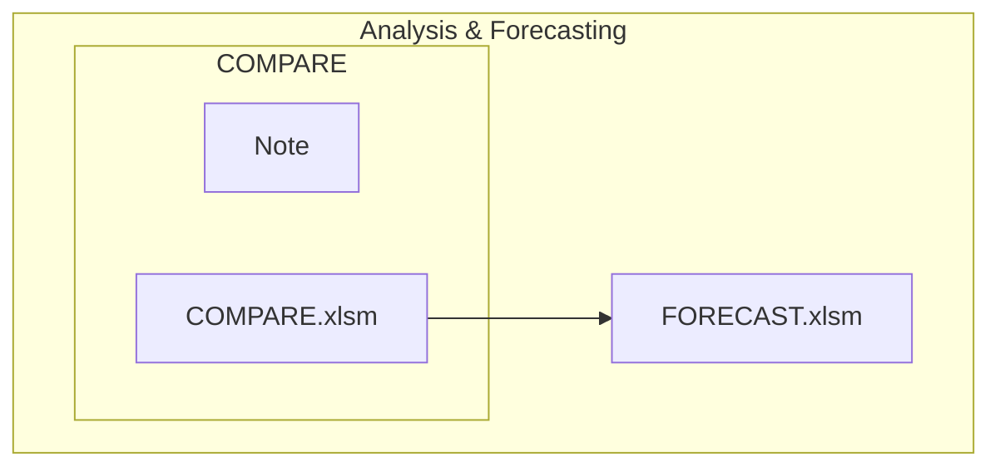

# KS LIM

Application System Engineer at ARVOS K.K.  
Since September 2026

## Current Project Focus

## Development Environment

| Category | Tool | Reference |
|-----------|------|-----------|
| Code Editor | Visual Studio Code ||
| Version Control | Git ||
| Git Client | SourceTree ||
| Database Management | SQL Server Management Studio (SSMS) ||
| Database Platform | Microsoft SQL Server ||
| Programming Language | Python ||
| JavaScript Runtime | Node.js LTS ||
| Linux Environment | Ubuntu / WSL | https://github.com/kiansenglim/LINUX_CHEATSHEET |
| Data Analysis & Prototyping | JupyterLab / Jupyter Notebook ||
| API Development & Testing | Postman ||
| Database Client | DBeaver Community ||
| File Comparison | WinMerge ||
| Diagramming & Documentation | Draw.io, Mermaid ||

## Documentation & Diagramming

### Mermaid Diagram Learning

#### Topics Learned

- Learned how to create nested subgraphs (subgraphs within subgraphs).
- Learned how to create note-style nodes for additional explanations.
- Learned how to use `LR` (Left-to-Right) and `TD` (Top-to-Down) to control diagram layout and flow direction.
- Learned how to apply custom styles using `classDef`.
- Learned how to customize node appearance using colors, borders, and notes.

#### Mermaid Cheat Sheet

#### Common Layout Directions

| Direction | Description |
|------------|-------------|
| `TD` | Top-to-Down |
| `TB` | Top-to-Bottom |
| `LR` | Left-to-Right |
| `RL` | Right-to-Left |

#### Common Styling Examples

#### Mermaid Color Legend

| Type | Color |
|--------|--------|
| XLSX Data / Master File | 🟦 Light Blue |
| XLSM Application | 🟩 Light Green |
| Documentation | 🟨 Light Yellow |
| Analysis Tool | 🩷 Light Pink |
| Note | No Border / No Fill |

#### Useful Mermaid Snippets

**Create a Note**

**Nested Subgraphs**

## Areas of Interest

- Business Application Development
- Database Management & SQL
- Python Django Development
- Business Process Automation
- ERP & System Integration
- Digital Transformation

## Currently Learning

- ToshiMAX CRM Architecture
- Legacy System Modernization
- Mermaid Diagram Design
- Business Process Documentation
- SQL Server Administration
- Python Automation

## Notes

### ToshiMAX

- Organize the ToshiMAX applications.
  - The Procurement Department uses `プロジェクト追跡(2H).xlsm` for reference purposes only and does not perform any data entry.

### CRM Sales Cycle

The CRM opportunity stages are defined as follows:

| Status | Probability (%) |
|----------|----------:|
| Won | 100 |
| (Pre) 先行手配 | 100 |
| A | 98 |
| B1 | 95 |
| B2 | 90 |
| B3 | 80 |
| C | 70 |
| D | 10 |
| Lost | 0 |
| Cancel | 0 |
| Delete | 0 |
| Case Study | 0 |

These stages
